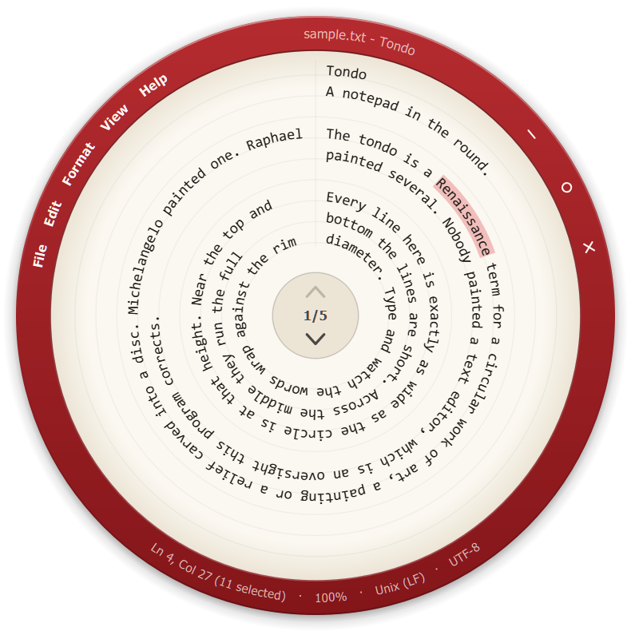
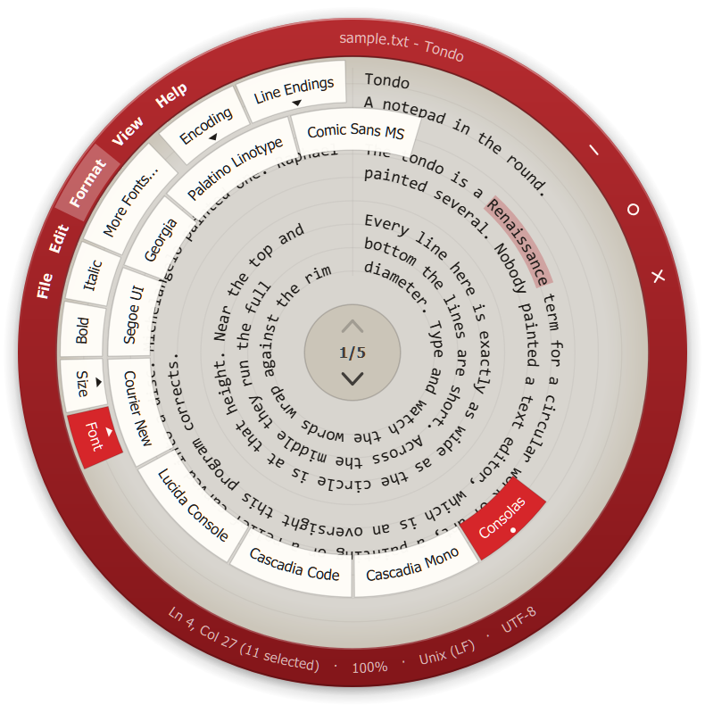
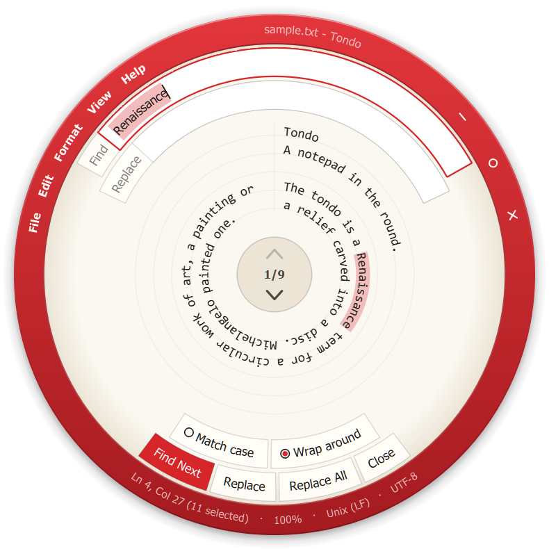
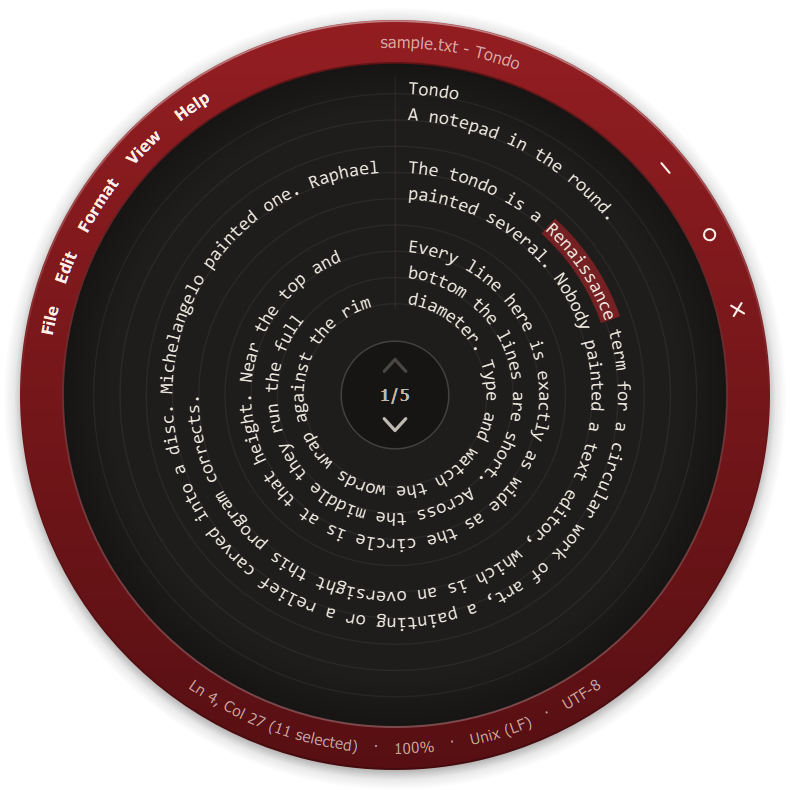

<div align="center">


# Tondo

**Notepad, rebuilt so that nothing in it is a rectangle.**

[](https://github.com/Locke-Werks/tondo/releases)
[](LICENSE)
[](#requirements)

</div>

---

<p align="center">
  
  
</p>

A tondo is a Renaissance painting on a round panel. This one holds plain text.

The window is a disc. Every line of text is a ring: it starts at the seam at
twelve o'clock, runs clockwise all the way round with each letter set on the
tangent, and the next line is the next ring in. When the rings reach the hub,
the text carries on onto the next page. The menu bar is an arc of the bezel,
menus open as rings, submenus open as rings inside those, and Find, Replace,
Go To and the save question are rings too.

<p align="center">
  
  
</p>

## Using it

| Where | What it does |
| --- | --- |
| File, Edit, Format, View, Help on the bezel | Open that menu as a ring |
| Right-click the bezel | All five menus as one ring |
| Right-click the text | Edit menu as a ring, where you clicked |
| Drag the bezel | Move the window |
| Drag the outermost edge of the bezel | Resize the circle around its center |
| Double-click the bezel | Grow to the largest circle the screen fits, or back |
| The hub | Upper half turns back a page, lower half turns forward |
| Mouse wheel | Turn pages |
| Ctrl + wheel | Zoom |

Up and Down move to the next ring out or in at the same angle. Home and End go
to the start and end of the ring. Page Up and Page Down turn a page. In a menu
ring, the arrow keys go round, Enter opens or chooses, Escape backs out one
ring, and typing an item's Notepad access letter (or its first letter) picks
it. Alt+F, Alt+E,
Alt+O, Alt+V and Alt+H open the menus from the keyboard, and F10 opens File.

The rest is Notepad, with Notepad's shortcuts: New, New Window, Open, Save,
Save As, Page Setup, Print, Undo, Redo, Cut, Copy, Paste, Delete, Find, Find
Next (F3), Find Previous (Shift+F3), Replace, Go To, Select All, Time/Date (F5),
Font, Zoom, Status Bar.

Files open as UTF-8, UTF-8 with BOM, UTF-16 LE or BE, or the ANSI code page, and
save back the way they came, with their original line endings. Both can be
changed under Format. Printing puts each page's rings on their own sheet.

Three things are still rectangles, because Windows draws them: the Open and Save
dialogs, the Print and Page Setup dialogs, and More Fonts. Everything Tondo
draws itself is round.

## Requirements

Windows 10 or 11, x64. Release builds bundle the Qt runtime.

## Building

Qt 6.5 or later with the MSVC kit, CMake 3.21, Visual Studio 2022 or later.

```
cmake --preset vs -DCMAKE_PREFIX_PATH=C:/Qt/6.8.3/msvc2022_64
cmake --build --preset release
C:\Qt\6.8.3\msvc2022_64\bin\windeployqt.exe build\vs\Release\tondo.exe
```

## How the rings work

`RingTextLayout` replaces Qt's document layout. Each line is given its ring's
arc length as its width, so `QTextLayout` still does the shaping and the line
breaking, and then every glyph is placed at the angle its position along that
line maps to and turned to the tangent there. `RoundEdit` is the editor around
it: a `QTextDocument` for storage, undo and search, with cursor movement,
hit-testing and selection all done by radius and angle.

## License

GPLv3. See [LICENSE](LICENSE).
